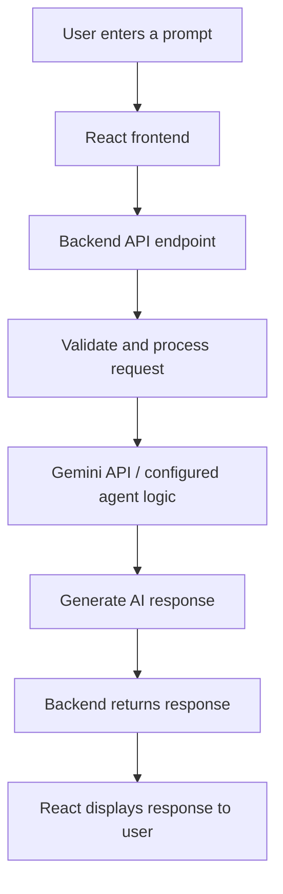

# Enterprise Multi-Agent AI Assistant

A web-based AI assistant designed to make AI-powered task support more organized through a conversational interface and a multi-agent workflow, using the Gemini API for generative AI responses.

**Live Demo:** https://enterprise-multi-ai-agent-assistant-2.onrender.com/

## Overview

The **Enterprise Multi-Agent AI Assistant** is a project focused on AI-assisted conversations and workflow support. The application combines a React-based user interface with a backend service that handles API requests and connects the application to the Gemini API.

The goal is to provide a convenient interface where users can submit prompts and receive AI-generated responses. The multi-agent approach can be used to separate responsibilities into specialized tasks and coordinate the overall response, depending on how the agents are configured in the implementation.

## Key Objectives

- Provide a simple, interactive interface for communicating with an AI assistant.
- Integrate the Gemini API for AI-generated responses.
- Organize backend request handling through API endpoints.
- Explore multi-agent coordination and workflow automation.
- Keep frontend and backend responsibilities separate for maintainability.

## Features

- **Interactive UI:** A React interface for entering prompts and viewing responses.
- **Gemini API integration:** Uses Google's Gemini models through a backend integration.
- **Backend API:** Handles frontend requests and communicates with the AI service.
- **Multi-agent workflow concept:** Supports dividing a larger request into specialized tasks when implemented in the agent logic.
- **Deployable web application:** Hosted demo available through Render.

> Note: The exact agent names, database features, authentication, file uploads, and conversation-history behavior depend on the current source code. Add them to this list only if they are implemented in your repository.

## Technology Stack

| Layer | Technology |
|---|---|
| Frontend | React |
| Backend | Node.js / Express |
| Generative AI | Google Gemini API |
| Deployment | Render |
| API communication | HTTP/REST |

## Application Workflow



1. The user enters a prompt in the web interface.
2. The React frontend sends the request to the backend API.
3. The backend processes the request and calls the Gemini API or the configured agent workflow.
4. The AI service generates a response.
5. The backend returns the result to the frontend.
6. The UI displays the response to the user.

## Getting Started

### Prerequisites

Install the following before running the project locally:

- Node.js (LTS version recommended)
- npm
- A Google Gemini API key
- Git

### 1. Clone the repository

```bash
git clone <YOUR_GITHUB_REPOSITORY_URL>
cd <YOUR_PROJECT_DIRECTORY>
```

Replace the placeholders with your repository URL and project directory.

### 2. Install dependencies

Install dependencies in each application folder. For example, if your project has separate `client` and `server` folders:

```bash
cd client
npm install

cd ../server
npm install
```

If your repository uses different folder names or a single root `package.json`, use the corresponding directories and scripts from your project.

### 3. Configure environment variables

Create a `.env` file in the **backend** directory and add the variables expected by your server code. For example:

```env
GEMINI_API_KEY=your_gemini_api_key
PORT=5000
```

Use the exact variable name referenced in your code. If your code expects `GOOGLE_API_KEY` or another name instead of `GEMINI_API_KEY`, configure that exact name.

**Important:** Never commit your real API key to GitHub. Add `.env` to `.gitignore` and keep secrets in the backend environment only.

Example `.gitignore` entries:

```gitignore
node_modules/
.env
dist/
build/
```

### 4. Start the backend

From the backend directory, run the script defined in its `package.json`. Common examples are:

```bash
npm run dev
```

or:

```bash
npm start
```

Use whichever script your project actually defines.

### 5. Start the frontend

Open another terminal, go to the frontend directory, and run:

```bash
npm run dev
```

For a Create React App project, the command may instead be:

```bash
npm start
```

Open the local URL printed by the frontend development server.

## Deployment on Render

The live application is hosted at:

https://enterprise-multi-ai-agent-assistant-2.onrender.com/

For a split frontend/backend deployment:

1. Deploy the backend as a Render Web Service.
2. Add the Gemini API key in the backend service's **Environment** settings.
3. Set the frontend's API base URL to the deployed backend URL.
4. Redeploy the frontend after changing its environment variables.
5. Confirm that frontend API requests use the correct backend URL and route.

Environment variable names are framework-specific. For example, Vite frontend variables usually need the `VITE_` prefix, while Create React App variables usually need the `REACT_APP_` prefix. Do not put a secret Gemini API key in a frontend variable; frontend variables are exposed to browser users.

## API Configuration Notes

- Keep the Gemini API key on the server.
- Ensure the frontend base URL and backend route match.
- Avoid accidental double slashes in API URLs, such as `https://api.example.com//api/ask`.
- Handle API errors and return helpful messages to the frontend.
- Check Render logs if requests fail after deployment.

## Security

- Do not expose API keys in client-side code.
- Do not commit `.env` files.
- Validate user input on the backend.
- Apply rate limiting and suitable error handling before exposing the service broadly.
- Review the relevant Google AI service terms and usage limits for your application.

## Future Enhancements

- Add clearly defined specialist agents for different task categories.
- Add agent routing and coordination with transparent task status.
- Support conversation history if persistence is required.
- Add authentication and role-based access where needed.
- Add structured logging, request limits, and automated tests.

## Author

**Project:** Enterprise Multi-Agent AI Assistant

**Live Demo:** https://enterprise-multi-ai-agent-assistant-2.onrender.com/

---

*This README describes the intended architecture at a high level. Update the setup commands, environment-variable names, folder paths, and feature list to match the exact source code in your repository.*
